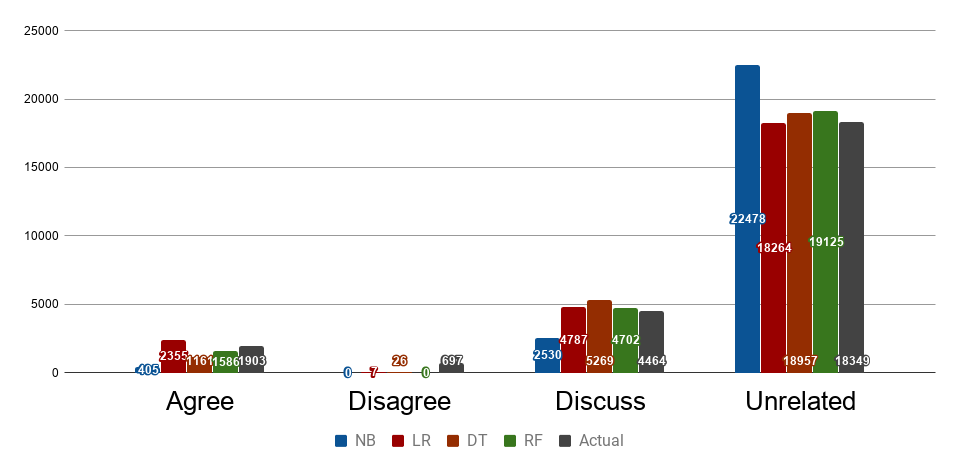

# 9417_MachineLearning

Assignment - Fake news

## Running / Installation

If you are running the code for the first time. Run the following commands in your python console

1) 

        -> import nltk
        -> nltk.download()
        
2) Install contractions library which is used in the pre-processing part

        -> pip install contractions==0.0.18
        
3) All the other libraries will come along with anaconda.

4) If you want to experiment with the pre processing and feature extraction results
you can delete the contents in the folders `preprocessed_data` and `final_features`.

### Implementation

1) `data_import.py` - This file imports the data from the dataset and we use the `competition_test` files to test the data.
2) `train_validation_split.py` - The train data that is imported from the csv files is split into 80 %
train and 20 % validation to check the results before testing them on the test data.
3) `preprocess.py` - We use different pre processing techniques like **tokenize**, **stopwords**, **stem/lemmatize** for the text data.
4) `feature_extraction.py` - we mainly use three different concepts to extract features from the text. They are:  
     
        1) Sentence Weighting 
        2) Ngrams (2 grams)
        3) TF-IDF Vectorizing
    
5) `models.py` - we mainly use four different ML algorithms to find the class labels. They are:  
     
        1) Random Forest Classifier
        2) Decision Tree Classifier
        3) Logistic Regression
        4) Naive Bayes
        
6) `metrics.py` -  We use different performance metrics like `Competition Score`, `Accuracy`, `Precision`,
`Recall`, `F1-score` to evaluate our labels.

7) `score.py` - This is the official scorer python file that is to be
used, to evaluate the results.

        
### Results and Comparisons

1) Percentage of correctness for different stances for all the 5 algorithms we compare with:

    
2) The accuracy - score chart for the dataset is: 

### Report
For detailed information about the repository please find the pdf attached in `report/report.pdf`
